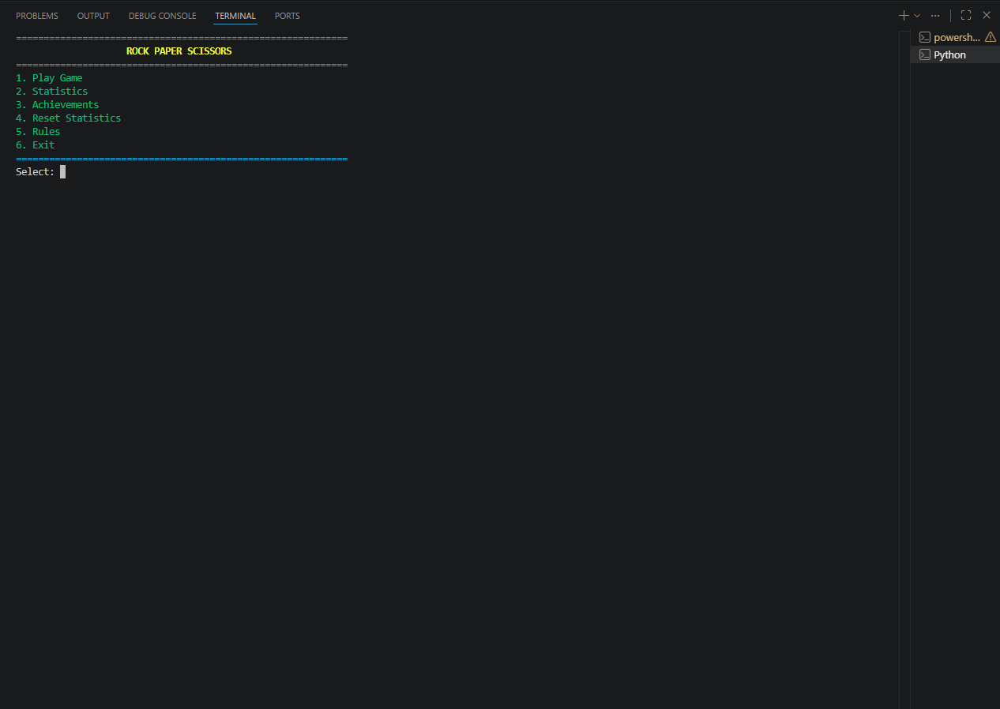
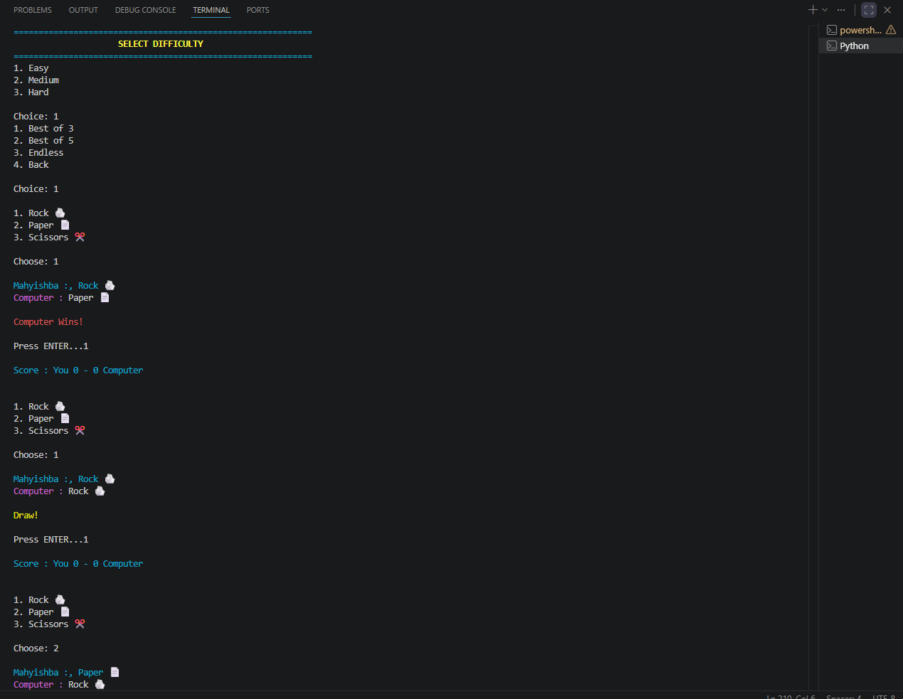
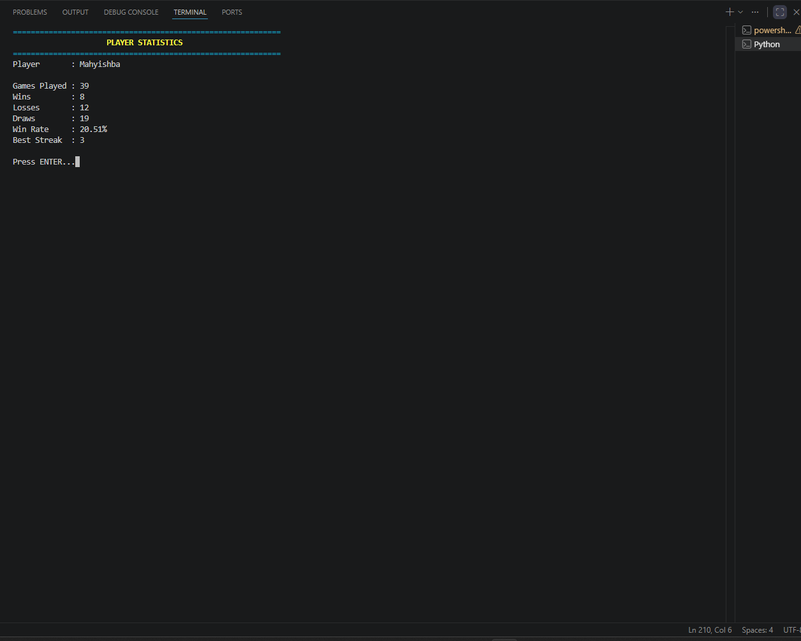
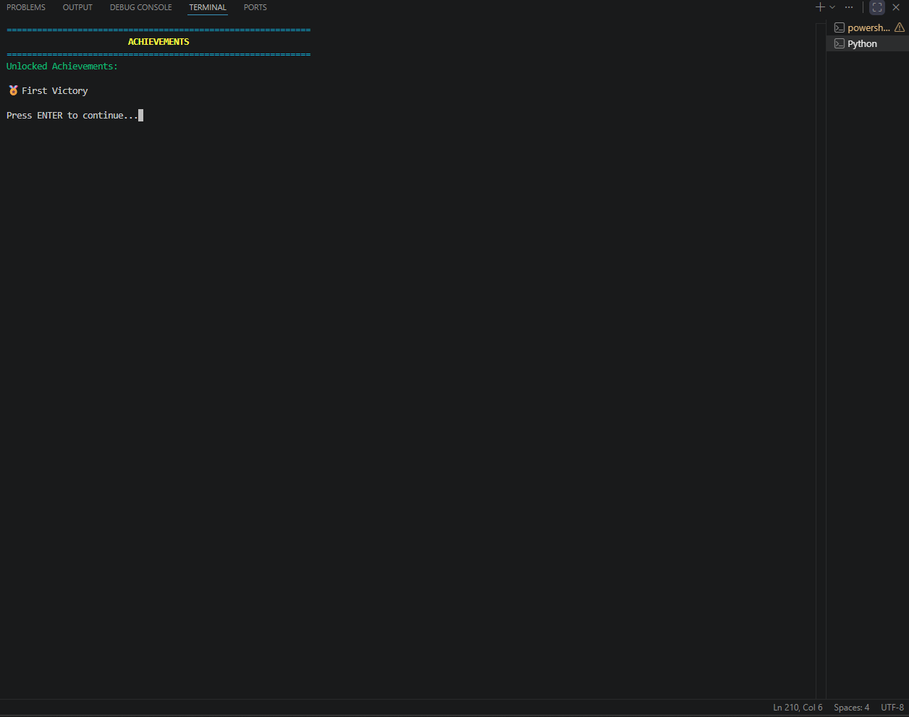
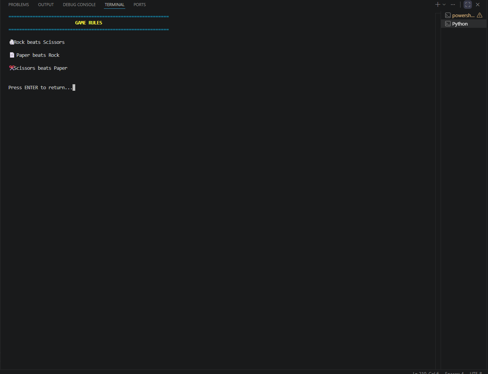
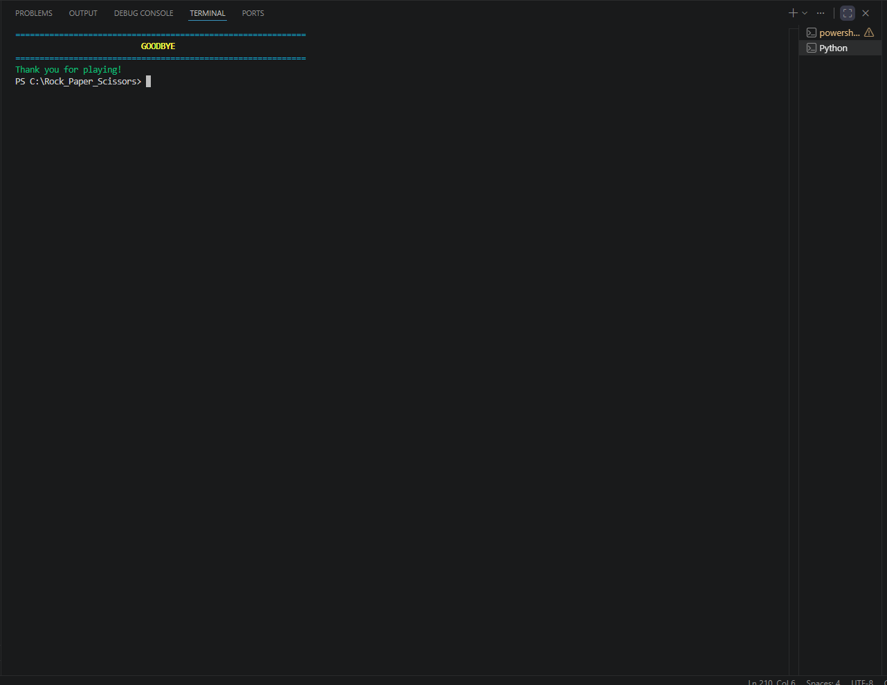

# 🎮 Rock Paper Scissors

A feature-rich terminal-based Rock Paper Scissors game built with Python. Challenge the computer, unlock achievements, track your statistics, and enjoy multiple game modes.

---

## ✨ Features

- 🎯 Three Difficulty Levels
  - Easy
  - Medium
  - Hard

- 🎮 Multiple Game Modes
  - Best of 3
  - Best of 5
  - Endless Mode

- 📊 Player Statistics
  - Games Played
  - Wins
  - Losses
  - Draws
  - Win Rate
  - Best Win Streak

- 🏆 Achievement System
  - 🏅 First Victory
  - 👑 Champion
  - 🔥 Hot Streak

- 💾 Automatic Save System (JSON)
- 🎨 Colored Terminal Interface
- 🤖 Computer AI
- 📖 Built-in Rules Menu

---

## 📂 Project Structure

```text
Rock_Paper_Scissors/
│
├── data/
│   └── stats.json
│
├── screenshots/
│   ├── main_menu.png
│   ├── gameplay.png
│   ├── statistics.png
│   ├── achievements.png
│   ├── rules.png
│   └── exit.png
│
├── rock_paper_scissors.py
├── requirements.txt
├── README.md
├── LICENSE
└── .gitignore
```

---

## 📸 Screenshots

### 🏠 Main Menu



---

### 🎮 Gameplay



---

### 📊 Statistics



---

### 🏆 Achievements



---

### 📖 Rules



---

### 👋 Exit Screen



---

## 🚀 Installation

Clone the repository:

```bash
git clone https://github.com/MahyishbaNazif/Rock_Paper_Scissors.git
```

Go into the project:

```bash
cd Rock_Paper_Scissors
```

Install dependencies:

```bash
pip install -r requirements.txt
```

Run the game:

```bash
python rock_paper_scissors.py
```

---

## 🛠️ Technologies Used

- Python 3
- Colorama
- JSON
- Git
- GitHub

---

## 👨‍💻 Author

**Mahyishba Nazif**

- GitHub: https://github.com/MahyishbaNazif
- LinkedIn: https://www.linkedin.com/in/mahyishba-nazif-703831370/

---

## ⭐ Support

If you like this project, consider giving it a ⭐ on GitHub.
